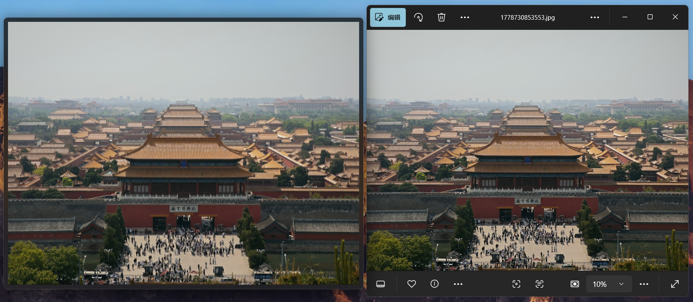
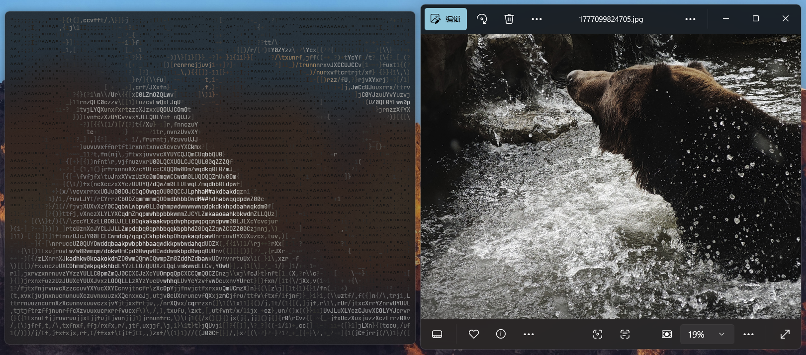
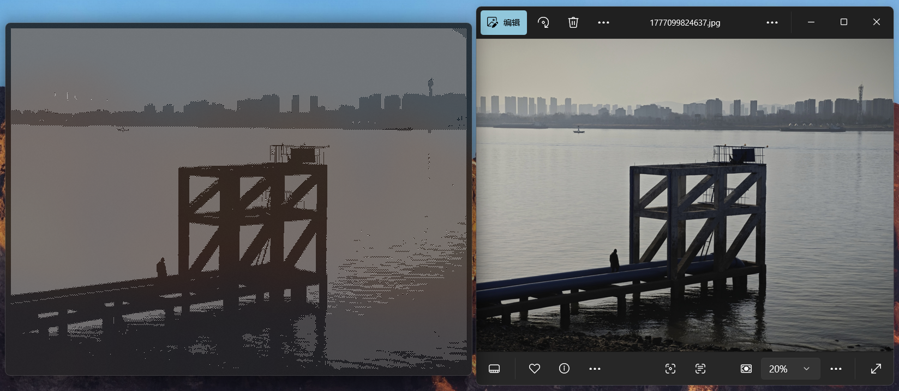

# PixelBrush

Convert images to terminal ASCII art.

| [中文](README.md) | English |
| ----------------- | ------- |

## Features

- 24-bit true color / 256-color grayscale / black & white output
- Multiple brush presets
- Auto-fit to console window size
- Supports redirection to file output

> Make sure your terminal emulator supports VT sequences (e.g., ConEmu, Windows Terminal).

## Gallery

High-resolution photo rendered at small character size.



> Rendered at a sufficiently small character size.

---

Readable characters used as brush strokes.



---

Brightness-mapped characters for a distinctive black & white look. Black & white mode only works correctly with certain brushes.



> Rendered at a sufficiently small character size.

## Build

Built with [Xmake](https://xmake.io/).

```sh
xmake
```

## Usage

```sh
pixelbrush <image-path> [OPTIONS]
```

Run `pixelbrush` without arguments to view the full parameter list.

### Brushes

```sh
pixelbrush --brush <brush-name>
```

| Name              | B&W Mode | Description                    |
| ----------------- | :------: | ------------------------------ |
| `block` (default) |    —     | Solid color pixel blocks       |
| `dot`             |    —     | Solid color dots               |
| `shades`          |    ✓     | Brightness-mapped pixel blocks |
| `symbols`         |    ✓     | Symbols                        |
| `letters`         |    ✓     | Symbols and letters            |

Brushes with brightness mapping produce slightly dimmer colors in true color mode but support proper black & white rendering.

### Black & White

```sh
pixelbrush --blackwhite
```

Selects brush characters based on pixel brightness for a high-contrast display effect. Only supported by certain brushes.

### Grayscale

```sh
pixelbrush --grayscale
```

Maps pixel brightness to shades of gray. More broadly compatible than pure black & white, with a softer display effect.

### Width Scale

Terminal character aspect ratios vary across platforms and devices. If each character maps to one pixel, the output may appear stretched. Since most modern terminals render characters at roughly 2:1 width-to-height ratio (two characters ≈ a square), PixelBrush sets a default width scale of **2.0**. If the output appears distorted, adjust it with `--wscale <FLOAT>` — any floating-point value is accepted.

### Output Size

In terminal mode, PixelBrush automatically computes the best output size to avoid stretching or cropping based on the available console space. To manually set the output size, use `--size <W> <H>`. The width value should account for the width scale factor. For example, at the default scale of 2, to render a common 4:3 image with 400 effective columns (effectively 300 rows), use `--size 800 300` (400 × 2 = 800).

### Output to File

```sh
pixelbrush <image-path> > out.txt
```

Redirect output to a file using `>`. PixelBrush does not optimize for file output — the file will contain ANSI escape sequences and the output size follows the original image dimensions, which can lead to very large files. It is therefore recommended to:

- Use `--blackwhite` mode to avoid color control sequences.
- Use a brush that supports black & white mode.
- Manually specify output size with `--size` to prevent uncontrolled file growth.

## Examples

```bash
pixelbrush photo.jpg --brush block --grayscale
pixelbrush image.png -b symbol --size 80 40
pixelbrush photo.bmp --blackwhite > output.txt
```
