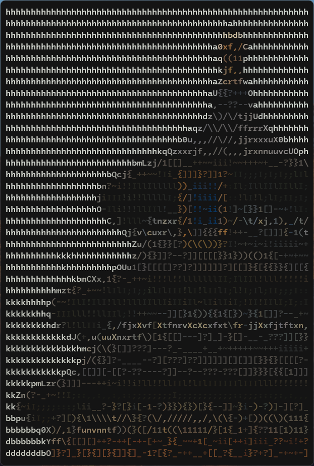
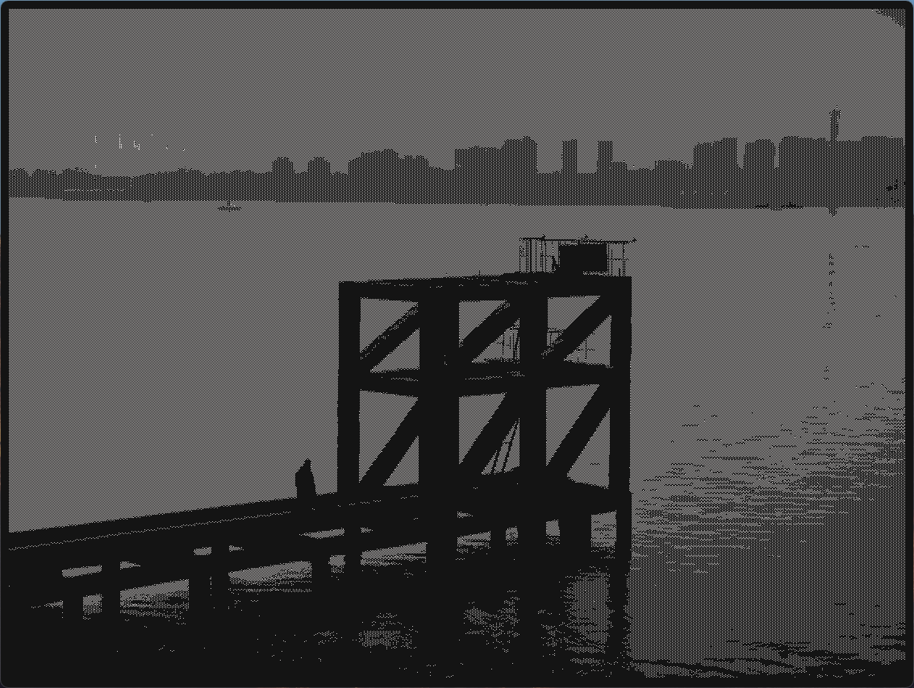
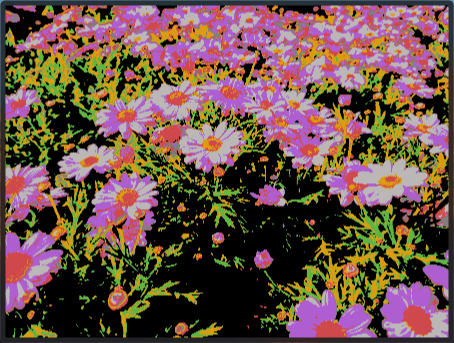
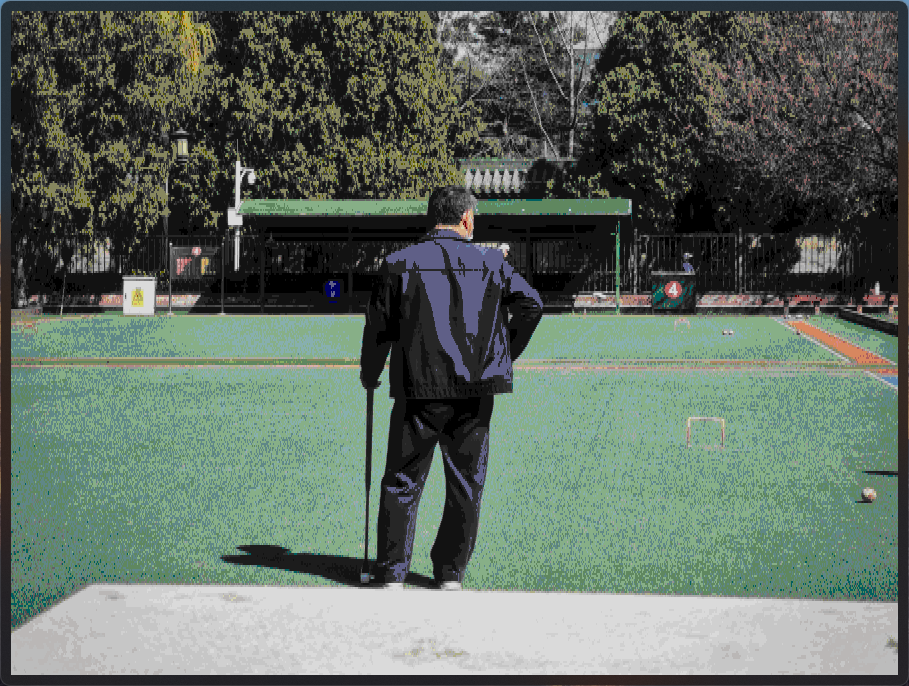
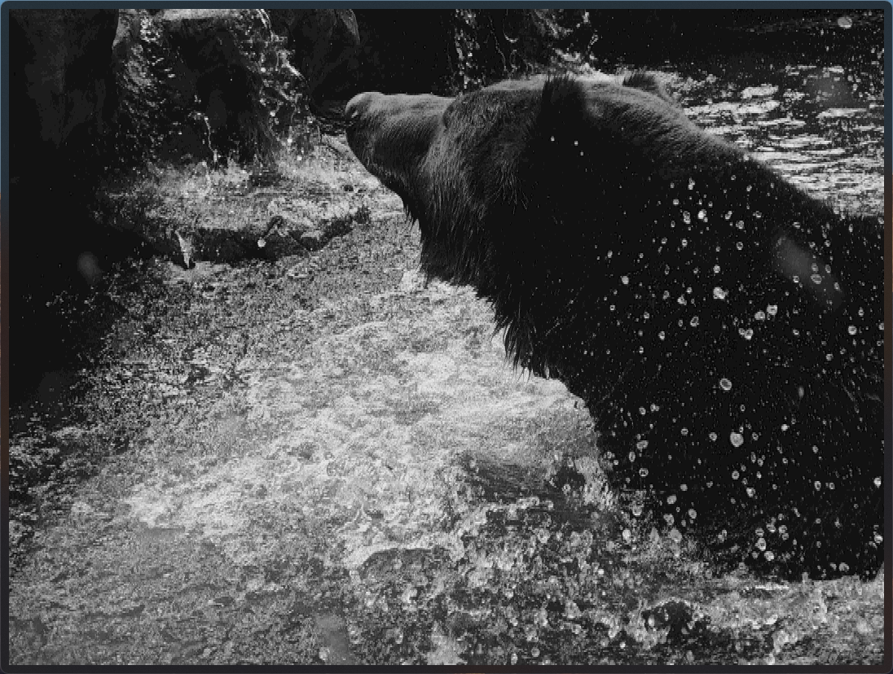

# PixelBrush

Convert images to terminal ASCII art.

| [中文](README.md) | English |
| ----------------- | ------- |

## Features

- Multiple color output modes
- Multiple brush presets
- Auto-fit to console window size
- Supports redirection to file output

> Make sure your terminal emulator supports VT sequences (e.g., ConEmu, Windows Terminal). Windows only.

## Gallery

High-resolution photo rendered.


> Rendered at a sufficiently small character size, truncated for display.

---

Readable characters used as brush strokes.



---

Brightness-mapped characters for a distinctive black & white look. Black & white mode only works correctly with certain brushes.



## Build

Built with [Xmake](https://xmake.io/).

After cloning the project for the first time, initialize the submodule:

```sh
git submodule update --init --recursive
```

Then build simply with:

```sh
xmake
```

## Usage

```sh
pixelbrush <IMAGE-PATH> [OPTIONS]
```

Run `pixelbrush` without arguments to view the full parameter list.

### Brushes

```sh
# Both forms work
pixelbrush -b <BRUSH-NAME>
pixelbrush --brush <BRUSH-NAME>
```

| Name              | B&W Mode | Description                    |
| ----------------- | :------: | ------------------------------ |
| `block` (default) |    —     | Solid color pixel blocks       |
| `dot`             |    —     | Solid color dots               |
| `shades`          |    ✓     | Brightness-mapped pixel blocks |
| `symbols`         |    ✓     | Symbols                        |
| `letters`         |    ✓     | Symbols and letters            |

Brushes with brightness mapping produce slightly dimmer colors in true color mode but support proper black & white rendering.

### Color Mode

```sh
pixelbrush -c <MODE>
# or
pixelbrush --color <MODE>
```

| Mode         | Description                                                           | Example                                        |
| ------------ | --------------------------------------------------------------------- | ---------------------------------------------- |
| `truecolor`  | 24-bit true color (default)                                           |                                                |
| `tty16`      | Classic 16 colors, sourced from your terminal's color theme           |          |
| `tty256`     | Terminal 256-color mode                                               |        |
| `grayscale`  | Grayscale mode, displays image info using different brightness levels |  |
| `blackwhite` | Black & white mode, unique high contrast effect                       |       |

### Scale Mode

```sh
pixelbrush -m <MODE>
# or
pixelbrush --scale-mode <MODE>
```

Selects the resampling algorithm used when scaling images. Use `Nearest` for pixel art or when sharp edges must be preserved; use `Fant` for continuous-tone images.

| Mode             | Description                                                                  |
| ---------------- | ---------------------------------------------------------------------------- |
| `Fant` (default) | High-quality antialiased scaling, suitable for photos                        |
| `Nearest`        | Nearest-neighbor interpolation, preserves hard edges, suitable for pixel art |

### Width Scale

The aspect ratio of a character in a terminal is uncertain. If each character maps to one pixel, the output may appear stretched. `PixelBrush` defaults to assuming "two characters ≈ a square" for modern terminals, setting the width scale to **2.0** by default. If the output appears distorted on your device, adjust it with `-w <FLOAT>` or `--wscale <FLOAT>` — any floating-point value is accepted.

### Output Size

In terminal mode, `PixelBrush` automatically computes the best output size to avoid stretching or cropping based on the available console space. To manually set the output size, use `-s <W> <H>` or `--size <W> <H>`. The width value should account for the width scale factor. For example, at the default scale of 2, to render a common 4:3 image with 400 effective columns (effectively 300 rows), use `--size 800 300` (400 × 2 = 800).

### Output to File

```sh
pixelbrush <IMAGE-PATH> -o out.txt
```

Write output to a file using `--output` / `-o`.

`--output` can be combined with `--format` / `-f` to specify the output encoding:

```sh
pixelbrush <IMAGE-PATH> -o out.txt -f UTF8
```

| Format              | Description        |
| ------------------- | ------------------ |
| `UTF8`              | UTF-8 encoding     |
| `UTF16LE` (default) | UTF-16 LE encoding |

> UTF-16 LE always has better performance because Windows uses it as its default Unicode encoding. `PixelBrush` defaults to UTF-16 LE for the same reason; encoding to any other format requires an extra conversion step.

> `PixelBrush` does not optimize for file output — the file will contain ANSI escape sequences and the output size follows the original image dimensions, which can lead to very large files. Therefore, it is recommended to use `--color blackwhite` mode (which produces no color control sequences) with a brush that supports black & white mode, and to manually specify the output size with `--size` to prevent uncontrolled file growth.

> When using shell redirection (e.g. `pixelbrush image.jpg > output.txt`), the output file may contain incorrect text because PowerShell's default encoding for redirection is unpredictable. Traditional Command Prompt does not have this issue.

## Examples

```bash
pixelbrush photo.jpg -b block --color grayscale
pixelbrush image.png -b symbols --size 80 40
pixelbrush photo.bmp -c blackwhite -b shades -o output.txt
```
